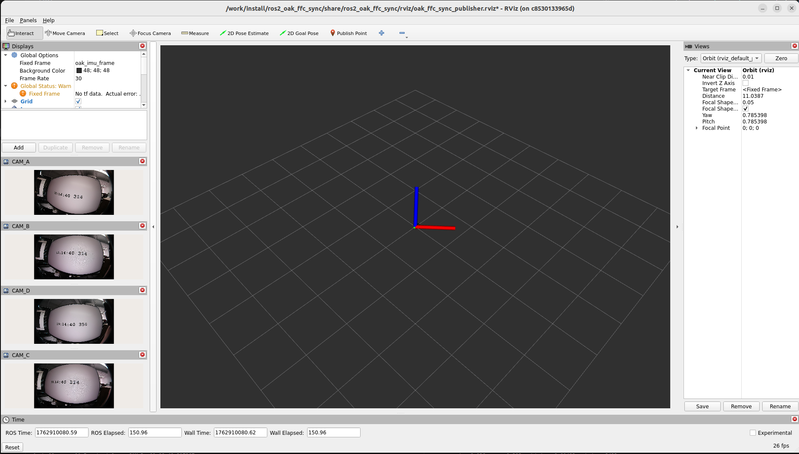

# 📷 OAK-4P-New-ROS2 使用指南

## 📖 目录
- [📷 OAK-4P-New-ROS2 使用指南](#-oak-4p-new-ros2-使用指南)
  - [📖 目录](#-目录)
  - [概述](#概述)
  - [🔄 更新 IMU 固件](#-更新-imu-固件)
  - [🏠 本地运行](#-本地运行)
    - [0. 配置udev](#0-配置udev)
    - [1. ⚙️ 安装依赖](#1-️-安装依赖)
    - [2. 🛠️ 编译工作空间](#2-️-编译工作空间)
    - [3. 🚀 运行程序](#3--运行程序)
  - [🐳 Docker运行](#-docker运行)
    - [1. 🏗️ 构建镜像](#1-️-构建镜像)
    - [2. 🚢 运行容器](#2--运行容器)
  - [📸 相机配置](#-相机配置)
    - [支持的相机型号](#支持的相机型号)
    - [图像类型配置](#图像类型配置)
    - [分辨率配置](#分辨率配置)
    - [指定要使用的板载插座](#指定要使用的板载插座)
    - [帧率配置](#帧率配置)
    - [相机输出数据压缩](#相机输出数据压缩)
    - [IMU配置](#imu配置)
    - [帧同步阈值设置](#帧同步阈值设置)
  - [👀 Rviz可视化配置](#-rviz可视化配置)
    - [📡 IMU数据](#-imu数据)
    - [🖼️ 图像数据](#️-图像数据)
    - [Rviz预览](#rviz预览)
  - [📈 性能测试](#-性能测试)
    - [测试命令](#测试命令)
    - [测试结果](#测试结果)
  - [🔧 故障排除](#-故障排除)
    - [常见问题](#常见问题)
    - [获取帮助](#获取帮助)

---

## 概述

本指南介绍如何在 ROS2 Humble 环境中使用 OAK-4P-New 相机，支持四路相机同步采集和 IMU 数据获取。

## 🔄 更新 IMU 固件

在首次使用前，建议更新 IMU 固件：

```
# 下载固件更新脚本
wget https://gitee.com/oakchina/depthai-python/raw/main/examples/IMU/imu_firmware_update.py

# 运行固件更新
python imu_firmware_update.py
```

> **⚠️ 注意**: 
> - 确保相机已通过 USB 连接并具有访问权限
> - 更新过程中不要断开相机连接

## 🏠 本地运行

### 0. 配置udev

```bash
# 添加 udev 规则
echo 'SUBSYSTEM=="usb", ATTRS{idVendor}=="03e7", MODE="0666"' | sudo tee /etc/udev/rules.d/80-movidius.rules

# 重新加载 udev 规则
sudo udevadm control --reload-rules && sudo udevadm trigger
```

### 1. ⚙️ 安装依赖

安装depthai-core [下载地址](https://gitee.com/oakchina/depthai-core/releases/)

```bash
sudo apt install ./depthai_2.30.0_amd64.deb
```

安装ros相关

```bash
sudo apt update && sudo apt install curl -y
export ROS_APT_SOURCE_VERSION=$(curl -s https://api.github.com/repos/ros-infrastructure/ros-apt-source/releases/latest | grep -F "tag_name" | awk -F\" '{print $4}')
curl -L -o /tmp/ros2-apt-source.deb "https://github.com/ros-infrastructure/ros-apt-source/releases/download/${ROS_APT_SOURCE_VERSION}/ros2-apt-source_${ROS_APT_SOURCE_VERSION}.$(. /etc/os-release && echo ${UBUNTU_CODENAME:-${VERSION_CODENAME}})_all.deb"
sudo dpkg -i /tmp/ros2-apt-source.deb

sudo apt update
sudo apt install ros-humble-desktop
sudo apt install -y ros-humble-rviz2 ros-humble-rviz-imu-plugin
sudo apt install ros-humble-depthai-ros
sudo apt install python3-rosdep
sudo rosdep init
rosdep update
```

> **⚠️ 注意**
> 
> `ros-humble-image-transport` 需要 **3.1.12 及以上版本**。
> 
> ### 检查当前版本
> ```bash
> dpkg -l | grep ros-humble-image-transport
> ```
> 
> ### 若无法直接安装所需版本
> 
> 可前往 [ROS 官方 deb 仓库](https://mirrors.aliyun.com/ros2/ubuntu/pool/main/r/ros-humble-image-transport/) 手动下载并安装对应版本的 `.deb` 文件。


### 2. 🛠️ 编译工作空间
```bash
mkdir -p OAK_WS/src
cd OAK_WS/src
git clone https://gitee.com/oakchina/oak-4-p-new-ros.git
cd ..
rosdep install --from-paths src --ignore-src -r -y
source /opt/ros/humble/setup.bash
MAKEFLAGS="-j1 -l1" colcon build
```

### 3. 🚀 运行程序
```bash
source install/setup.bash
ros2 launch ros2_oak_ffc_sync oak_ffc_sync.launch.py
```

## 🐳 Docker运行

### 1. 🏗️ 构建镜像
```bash
docker build -t oak_ffc_sync_ros2 .
```

### 2. 🚢 运行容器
```bash
# 允许本地显示访问
xhost +local:docker

docker run -it --rm \
  -v /dev/:/dev/ \
  --privileged \
  -e DISPLAY \
  -v /tmp/.X11-unix:/tmp/.X11-unix \
  oak_ffc_sync_ros2 \
  ros2 launch ros2_oak_ffc_sync oak_ffc_sync.launch.py
```

## 📸 相机配置

### 支持的相机型号

在launch.py文件中可选择以下相机型号：
- 🔵 ar0234
- 🟢 ov9782

```
camera_name = LaunchConfiguration("camera_name", default="ar0234")
```

### 图像类型配置

在launch.py文件中可选择以下图像类型
- 🔵 color
- 🟢 mono
```
camera_type = LaunchConfiguration("camera_type", default="color") 
```

### 分辨率配置

在launch.py文件中可以选择以下分辨率：

|分辨率  | 尺寸         |
--------|--------------
| 1200p | 1920x1200   |
| 1080p | 1920x1080   |
| 800p  | 1280x800    |
| 720p  | 1280x720    |
| 480p  | 640x480     |
| 400p  | 640x400     |

```
resolution = LaunchConfiguration("resolution", default="1200p")
```

> **📝 重要提示：**
> - 不同相机型号支持的分辨率可能不同，请参考相机规格书
> - 高分辨率和高帧率会占用更多带宽和计算资源

### 指定要使用的板载插座

在launch.py文件指定要使用的板载插座：
- 🔴 CAM_A
- 🔵 CAM_B
- 🟢 CAM_C
- 🟡 CAM_D
```
cam_board_sockets = LaunchConfiguration("cam_board_sockets", default="[CAM_A, CAM_B, CAM_C, CAM_D]")
```

### 帧率配置

在launch.py文件中配置相机帧率：
```
fps = LaunchConfiguration("fps", default="30")
```

### 相机输出数据压缩

在launch.py文件中配置相机输出图像是否压缩：
- "1": 压缩
- "0": 不压缩
```
compressed = LaunchConfiguration("compressed", default="1")
```

### IMU配置

在launch.py文件中配置IMU频率：
```
imu_hz = LaunchConfiguration("imu_hz", default="200")
```

> **注意：**
> IMU频率设置过大反而会导致实际频率降低！

### 帧同步阈值设置

利用帧时间戳实现多相机帧同步

在launch.py文件中设置帧同步阈值（单位：ms）：
```
sync_threshold = LaunchConfiguration("sync_threshold", default="50")
```

## 👀 Rviz可视化配置

### 📡 IMU数据
- **Fixed Frame**: `oak_imu_frame`
- **Topic**: `/imu`

### 🖼️ 图像数据
- **Topics**:
  - `/CAM_A/image` (🔴 通道A)
  - `/CAM_B/image` (🔵 通道B)
  - `/CAM_C/image` (🟢 通道C)
  - `/CAM_D/image` (🟡 通道D)

### Rviz预览

使用rviz显示图像以及IMU数据



## 📈 性能测试

### 测试命令

```bash
# 测试图像帧率
ros2 topic hz  /CAM_D/image

# 测试 IMU 频率
ros2 topic hz /imu
```

### 测试结果

- [图像帧率](./resource/image_hz.png): ≥20FPS(1200p分辨率)
- [图像延迟](./resource/delay.png): ≈300ms
- [IMU频率](./resource/imu_hz.png): ≥100Hz

---

## 🔧 故障排除

### 常见问题

1. **Docker 显示问题**
   ```bash
   # 允许本地显示访问
   xhost +local:docker
   ```

2. **IMU 数据异常**
   ```bash
   # 重新运行固件更新
   python imu_firmware_update.py
   ```

### 获取帮助

如遇问题，请检查：
- 相机连接状态
- USB 线缆质量
- 系统日志：`dmesg | grep usb`
- ROS2 话题列表：`ros2 topic list`

---

**📝 注意**: 本指南基于 ROS2 Humble 版本编写，如使用其他版本可能需要相应调整。
